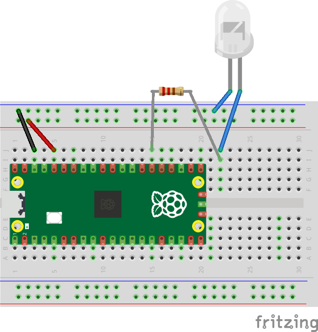

# Lesson 3
This lesson will show how to create your first electronic circuit.

We are going to use several components out of the Raspberry Pi kit, including:
- Pico Board
- Breadboard
- Jumper wires of several different colours
- An LED (whatever colour you choose)
- A 220 OHM resistor

1. Take the Pico board, and the solderless breadboard, and push the Pico pins into the breadboard such that the USB connector is closest to the end of the breadboard containing pin 1, and the board is centred on the breadboard.

    
0. Take a black wire and connect J3 to one of the holes in the __Negative__ column, as shown above.
    - With the Pico board positioned correctly, J3 will be connected to the __GND__ (ground) pin.
    - Several components in our circuit may need to connect to ground, so by using a jumper wire to connect J3 to the negative column on the breadboard, we now have 25 possible ground connections available to us.
0. Take a red wire and connect J5 to one of the holes in the __Positive__ column, as shown above.
    - With the Pico board positioned correctly, J5 will be connected to the __3V3__ (3.3 Volts DC) pin.
    - Several components in our circuit may need to connect to 3.3VDC, so by using a jumper wire to connect J5 to the positive column on the breadboard, we now have 25 possible 3.3VDC connections available to us.
0. Now, we want our circuit to do something, so let's add an LED.
    - We want to be able to control our LED from our software, so we need to connect it to a GPIO (General Purpose Input Output) pin.
    - If you have a look at the [Pico Pinout](../README.md#pico-pinout) you can see that many of the pins have a label starting with GP. I.E. GP1, GP15, etc.
    - We'll choose GP2, although any of the GP pins will do fine.
0. Find a 220 ohm resistor from the kit, and make a connection from J15 to I22.
    - This is the current limiting resistor, which is required to be in series with an LED so it doesn't pull too much current through the Microcontroller pin.
0. Find an LED in your kit, any colour is fine.
    - Connect the longer lead (the Anode) to J22, and the short lead (the Cathode) to the negative rail.
    - Your circuit should now look like this:

    
0. Connect your Pico to your PC using the USB cable.
0. In Thonny, create a new python file on the Pico. Call it "Lesson3.py".
0. Copy all the code from Lesson2.py, and paste it into Lesson3.py
0. Change the following line:

    ```
    Pin(25, mode=Pin.OUT, value=0)
    ```
    to:

    ```
    Pin(20, mode=Pin.OUT, value=0)
    ```
0. Save the file and run it.
    - The external LED should now be flashing.
