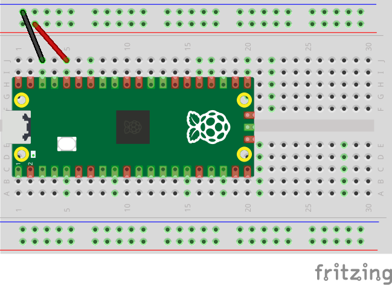

# Lesson 3
This lesson will show how to create your first electronic circuit.

We are going to use several components out of the Raspberry Pi kit, including:
- Pico Board
- Breadboard
- Jumper wires of several different colours
- An LED (whatever colour you choose)
- A 220 OHM resistor
- A beeper

1. Take the Pico board, and the solderless breadboard, and push the Pico pins into the breadboard such that the USB connector is closest to the end of the breadboard containing pin 1, and the board is centred on the breadboard.

    
0. Take a black wire and connect J3 to one of the holes in the __Negative__ column, as shown above.
    - With the Pico board positioned correctly, J3 will be connected to the __GND__ (ground) pin.
    - Several components in our circuit may need to connect to ground, so by using a jumper wire to connect J3 to the negative column on the breadboard, we now have 25 possible ground connections available to us.
0. Take a red wire and connect J5 to one of the holes in the __Positive__ column, as shown above.
    - With the Pico board positioned correctly, J5 will be connected to the __3V3__ (3.3 Volts DC) pin.
    - Several components in our circuit may need to connect to 3.3VDC, so by using a jumper wire to connect J5 to the positive column on the breadboard, we now have 25 possible 3.3VDC connections available to us.
