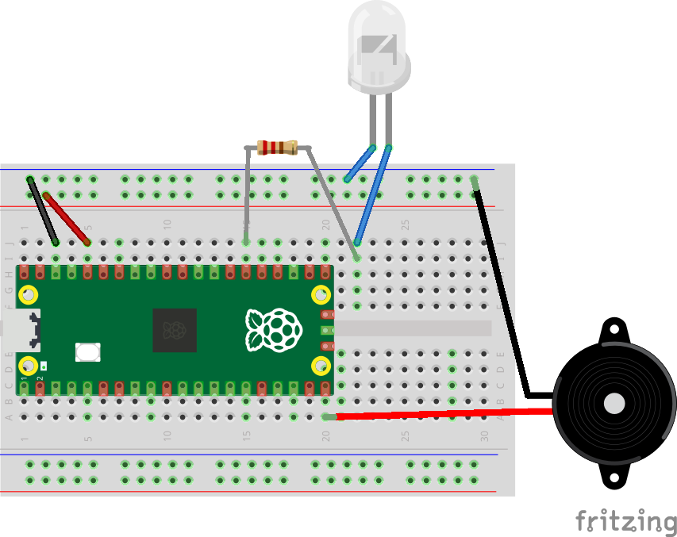

# Lesson 4
This lesson will show how to make a sound.

We are going to use several components out of the Raspberry Pi kit, including:
- Pico Board
- Breadboard
- Jumper wires of several different colours
- A beeper

This lesson will build upon the circuit from the [Lesson 3](../Lesson3/README.md).

1. Find the beeper in the kit. You'll notice it has a red wire and a black wire.
    - We are going to make a sound on the beeper by toggling the pin using PWM (Pulse Width Modulation). PWM functionality is found on the first 16 GP pins, so any of GP0 to GP15 can be used.
    - Connect the red wire to A20, which is GP15.
    - Connect the black wire to the negative column.
    - Your circuit should now look like this:
    
0. Connect your Pico to your PC using the USB cable.
0. In Thonny, create a new python file on the Pico. Call it "Lesson4.py".
0. Add the following to the start of the file:

    ```
    from machine import Pin, PWM
    import time

    beeper_pwm = PWM(Pin(15))
    beeper_pwm.duty_u16(0)

    while True:

        beeper_pwm.freq(5000)
        beeper_pwm.duty_u16(0)
        
        time.sleep_ms(500)

        beeper_pwm.freq(1000)
        beeper_pwm.duty_u16(65535 >> 1)
        
    ```
0. Save the file and run it.
    - The beeper should now be playing a note on and off.
    - Press "Stop" in Thonny to stop it playing.
0. Now let's make it easier to play a tune by creating a function to play a beep.
    - Above the while loop, add the following code:

    ```
    def beep(freq: int):
        if freq < 100:
            beeper_pwm.freq(5000)
            beeper_pwm.duty_u16(0)
        else:
            beeper_pwm.freq(freq)
            beeper_pwm.duty_u16(65535 / 2)
    ```
    - Here we've defined a function called __beep__. This function contains the code to enable or disable the PWMing of the beeper pin.
    - We pass the frequency we would like the beeper to play, with a higher frequency producing a higher pitch.
    - Moving code into functions makes our program easier to write and read.
0. Modify the while loop to the following:

    ```
    while True:
        beep(800)
        time.sleep_ms(500)
        beep(1000)
        time.sleep_ms(500)
        beep(1200)
        time.sleep_ms(500)
        beep(0)
        time.sleep_ms(1000)
    ```
0. Save the file and run it.
    - The beeper should now be playing a sequence of notes in a loop.
    - Press "Stop" in Thonny to stop it playing.