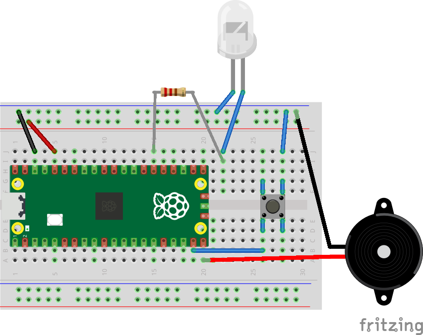

# Lesson 5
This lesson will show how do something based on a button press.

We are going to use several components out of the Raspberry Pi kit, including:
- Pico Board
- Breadboard
- Jumper wires of several different colours
- A button

This lesson will build upon the circuit from the [Lesson 4](../Lesson4/README.md).

1. Find the button in the kit. You'll notice it has 4 leads, 2 on one side and 2 on the opposite side.
    - We are just going to use 2 of the leads to detect whether the button is being pressed or not.
    - Push the button into the breadboard such that one pair of leads is in D26 and D28, and the other pair of leads is in G26 and G28.
    - We need to connect one lead from the button to ground, and the other to a GPIO pin on the Pico. We'll choose GP14 as the input pin.
    - Connect a jumper wire from B26 to B19.
    - Connect a jumper wire from J28 to the negative column.
    - Your circuit should now look like this:
    
0. Connect your Pico to your PC using the USB cable.
0. In Thonny, create a new python file on the Pico. Call it "Lesson4.py".
0. Add the following to the file:

    ```
    from machine import Pin
    import time

    button = Pin(14, mode=Pin.IN, pull=Pin.PULL_UP)
    button_last_pressed = not button.value()

    while True:
        button_pressed = not button.value()
        
        if button_pressed != button_last_pressed:
            if button_pressed:
                print(f"Button was just pressed")
            else:
                print(f"Button was just released")

        button_last_pressed = button_pressed
        
    ```
0. Save the file and run it.
    - Whenever we press or release the button, we should now see the state of the button printed out.
    - Press "Stop" in Thonny to stop it playing.
0. Note that when we configure GP14, we are enabling the internal pull-up resistor.
    - This is so that when the button isn't pressed, the input goes to a known state.
    - Without this it will probably float, and we won't be able to detect the button press properly.
0. Now let's toggle the LED when the button is pressed
    - Above the while loop, add the following code:

    ```
    led = Pin(20, mode=Pin.OUT, value=0)
    ```
    - Now, add the following line to occur only when the button is pressed.

    ```
    led.toggle()
    ```
    - The external LED should now toggle everytime the button is pressed.
0. You can experiment with getting the beeper to play a tune when the button is pressed, and then stop when it is pressed again.