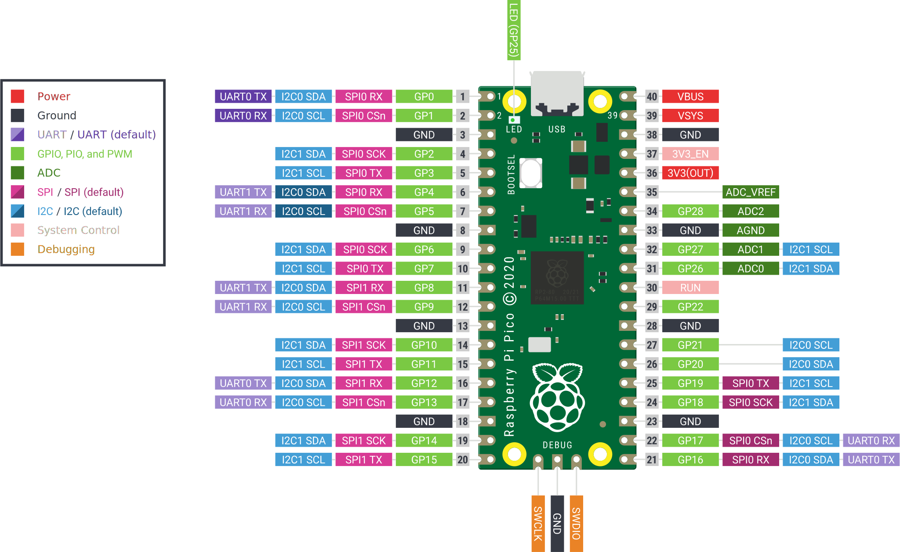

# MicroPython Lessons
These lessons assume the student has access to the [Raspberry Pi Mega Kit](https://littlebirdelectronics.com.au/products/raspberry-pi-5-mega-kit) from [Little Bird Electronics](https://littlebirdelectronics.com.au).

These lessons use the Raspberry Pi Pico board, and lessons/instructions here will be loosely based off the [Get started with MicroPython on Raspberry Pi Pico](https://littlebirdelectronics.com.au/products/get-started-with-micropython-on-raspberry-pi-pico-2nd-edition) book contained in the kit.

## Lessons
* [Lesson 1](/Lesson1/README.md)
* [Lesson 2](/Lesson2/README.md)
* [Lesson 3](/Lesson3/README.md)
* [Lesson 4](/Lesson4/README.md)
* [Lesson 5](/Lesson5/README.md)
* [Lesson 6](/Lesson6/README.md)

## Initial Setup
1. [Download](https://thonny.org/) and install the Thonny IDE, which is where we'll write our code and communicate with the Pico.
2. [Download](https://micropython.org/download/rp2-pico/rp2-pico-latest.uf2) the MicroPython for Pico firmware image.
3. While the USB cable is disconnected from your PC, connect the Micro-B end of the cable into the Pico Board.
4. While holding down the __BOOTSEL__ button on the Pico board, connect the other end of the USB cable into your PC.
   
   Count slowly to 3 and then release the button.
5. After several seconds, you should see a new removable drive appear called __RPI-RP2__.

   On an Apple Mac, you may be asked 'Allow accessory to connect?'. Click Allow to permit it.
6. Open the __RPI-RP2__ folder, where you should see the following files:
    - INDEX.HTM
    - INFO_UF2.txt
7. In another window, open the folder containing the firmware image (.uf2) that was previously downloaded.
8. Select the firmware image and drag-and-drop it into the __RPI-RP2__ folder.
9. The board will now be flashed with the MicroPython firmware image.
    - After several seconds the RPI-RP2 removable drive should disappear.
    - Any warnings about not being ejected properly can be ignored.
    - On an Apple Mac, you may be asked (again) 'Allow accessory to connect?'. Click Allow to permit it.
10. MicroPython should now be running on your Pico.
    - To test that it's working, follow [Lesson 1](/Lesson1/README.md).

## Pico Pinout

The original document can be found [here](https://datasheets.raspberrypi.com/pico/Pico-R3-A4-Pinout.pdf).

## Authors
* **Darren Pearce**

## License

This project is copyright All-Systems Electronics Pty Ltd, 2025.
